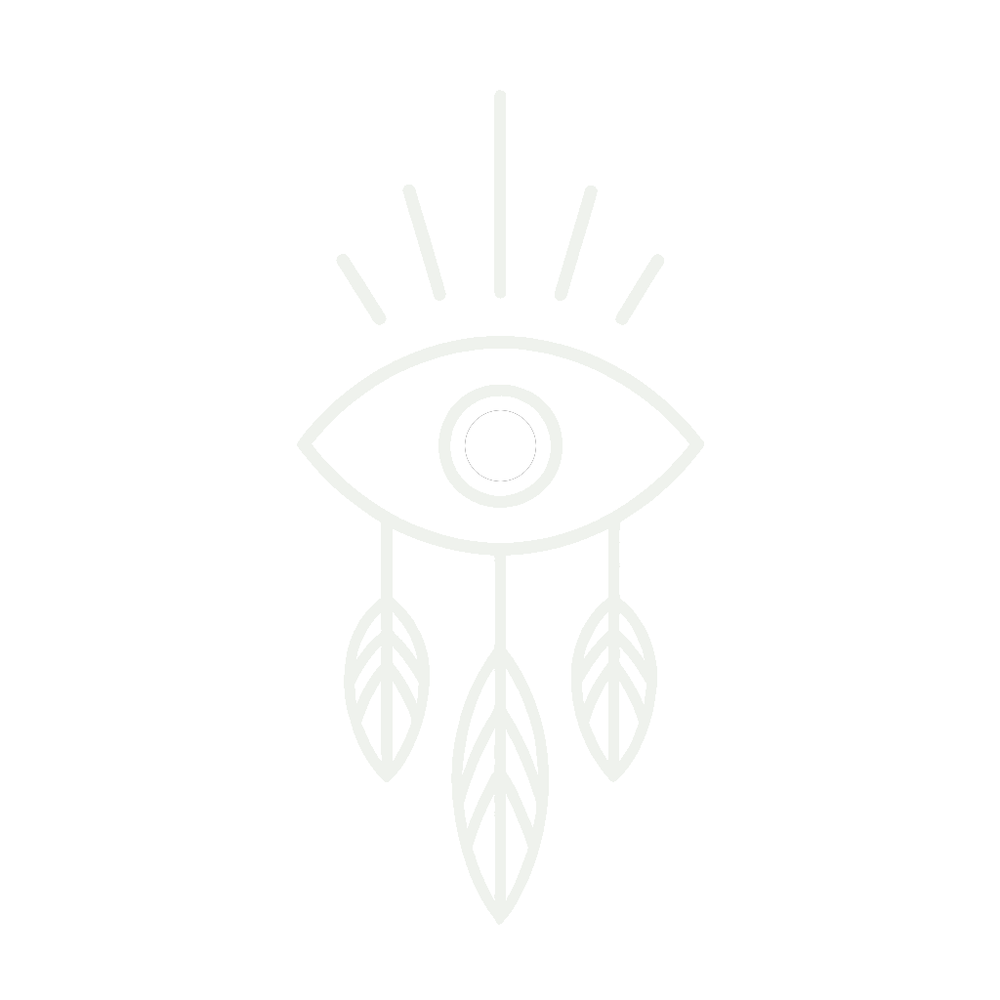

# DANIEL CUERVO

### SOFTWARE · ROBOTICS · INDUSTRIAL AUTOMATION

Ideas transformed into functional systems through code, experimentation and engineering.

[**ENTER PORTFOLIO**](https://corvo001.github.io)

---

## SELECTED WORK

### DYSON SWARM

Interactive simulation of orbital architectures and energy capture through satellite swarms.

### UNION

Experimental engine for generating, transforming and analysing fractal geometries in real time.

### AIDEN

Modular platform for OSINT research, identity correlation and public-information analysis.

---

**CREATIVITY, TECHNOLOGY AND SYSTEMS WITH AN IDENTITY OF THEIR OWN.**

[Portfolio](https://corvo001.github.io) · [GitHub](https://github.com/corvo001) · [LinkedIn](https://www.linkedin.com/in/danielcuervor/)

